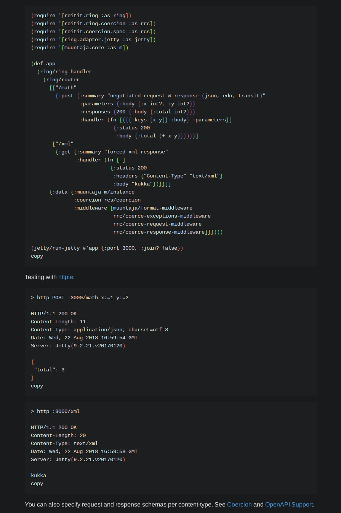
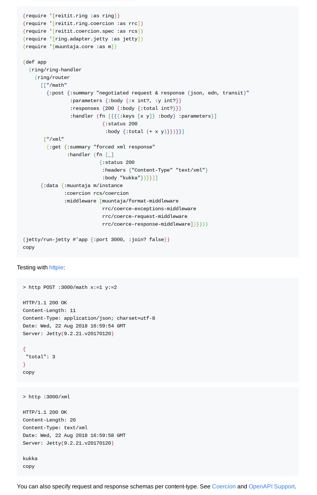

A rainbow delimiters userscript for https://cljdoc.org/
Features:
- Dark Reader aware
- Algorithmically generated palette of 32 colors
- Picks the best contrast relative to background and the next node

Tested with Tampermonkey on Brave. If you use a Chromium-based browser, remember to enable developer mode for your userscript handler extension.

Screenshots:

 
